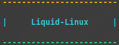

<b>Termux için Sanal Ortam</b>

### NOT: LİQUİD HALA YAPIM AŞAMASINDA EĞER HATALAR BULUNUYORSA VEYA ÖNERİLERİNİZ VAR İSE MUTLAKA BENİMLE İLETİŞİME GEÇ :)
## Discord: whycat#7306

### Özellikleri

- Grafik hızlandırması bulunuyor. (Hardware Acceleration [3D]-[X11])
- Ses Desteği Bulunuyor (Masaüstü ortamı ile)
- Hafif {En az 4GB Alanınızın bulunması gerekiyor(Masaüstü ortamı ile) }
- Font Desteği var
- Yeni başlayan Kullanıcılar için

### Kurulum
- İlk önce Termux indirmeniz gerekiyor. [BURADAN İNDİRİN](https://f-droid.org/repo/com.termux_118.apk) (Play Store'de bulunan sorunlu)
- Kurulum dosyalarını indirin & Kurulum dosyasını çalıştırın.

  - `apt update`
  - `apt install git wget ncurses-utils -y`
  - `git clone --depth=1 https://github.com/thisaducat/liquid-linux.git`
  - `cd liquid-linux`
  - `chmod +x *`
  - `./kur`

- Ardından Termux'u yeniden başlatın.

   - `liquid`
   - `set-liquid`

- Kullanıcı Adı ve Şifresi girin [Küçük harflerle & Boşluk kullanmadan]

- Liquid'i yeniden başlatın. Şu komutu yazın:

- `set-gui`

- Ardından Liquid'i yeniden başlat ve her şey hazır :)

### NOT :

- **Liquid'i güncellemek için `update` komutunu kullanın.**

- **Kaldırmak için `./sil` komutunu yazın.**

#
Licensed under [Apache License](./LICENSE)
#

### Yapımcı

- [**Aducat (whycat)**](https://github.com/thisaducat)

### Çalışmamı beğendiysen lütfen yıldız bırak :)

